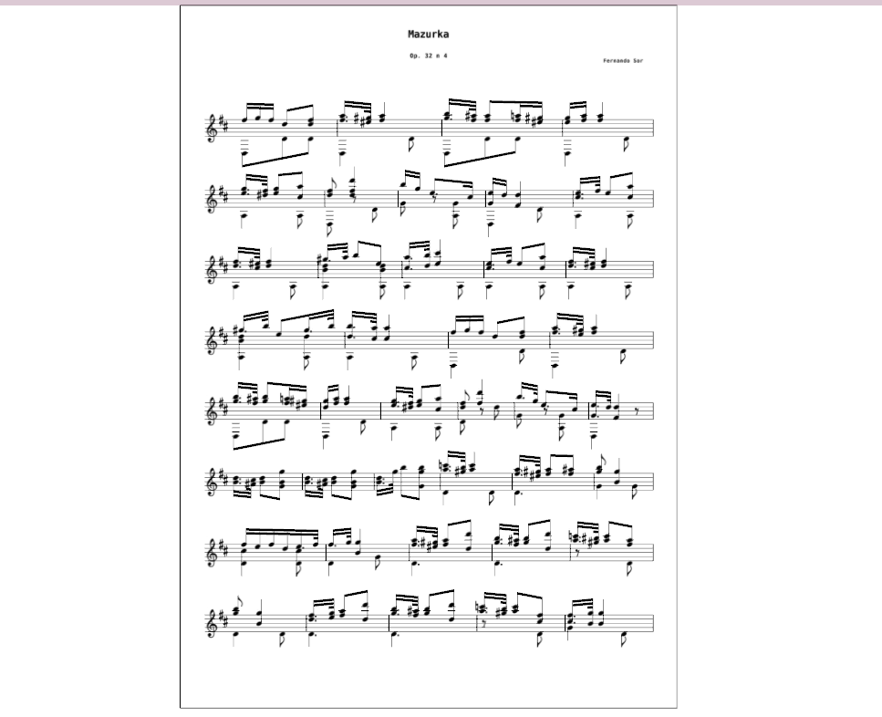

PySheetMusic
============

This is a Python library for parsing, rendering, playing sheet music. It use OpenGL to render.

Dependencies
------------
* PyOpenGL
* Raygllib
* lxml
* PyGame (For midi playing)

Screen shots
------------

